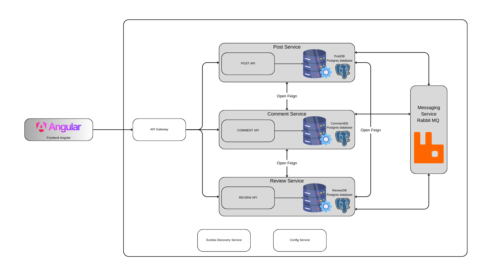

# Architecture

## 1. Frontend (Angular)
The frontend is built using Angular and serves as the user interface for the application.
It communicates with backend services through the API Gateway, which centralizes access to backend functionalities.
## 2. API Gateway
Acts as a single entry point for all frontend requests, simplifying and centralizing client-server interactions.
Routes incoming requests to the appropriate microservice (Post, Review, or Comment Service) based on the request.
## 3. Microservices Architecture
The application is organized into three independent microservices, each handling a specific part of the functionality:
### Post Service
Responsible for creating, reading, updating, and deleting posts.
Stores post-related data in its own PostgreSQL database (PostDB).
### Review Service
Manages reviews for posts.
Stores review-related data in its dedicated PostgreSQL database (ReviewDB).
### Comment Service
Handles comments on posts.
Uses its own PostgreSQL database (CommentDB) for storing comment data.
Each microservice operates independently with its own database, allowing for individual scaling, deployment, and maintenance.
## 4. Service Communication
OpenFeign:
A declarative HTTP client used for synchronous communication between microservices, allowing them to call each other’s APIs seamlessly.
Message Bus (RabbitMQ):
Enables asynchronous communication between services, facilitating event-driven interactions and decoupling services for improved scalability.
## 5. Eureka Discovery Service
Each microservice registers with Eureka, a service registry, allowing for dynamic discovery and interaction between services without hardcoded endpoints.
This enhances flexibility and resilience, as services can scale or restart without manual reconfiguration.
## 6. Config Service
Centralizes configuration management for all microservices.
Stores and distributes configuration settings, making it easier to update and maintain consistent configurations across the entire system.